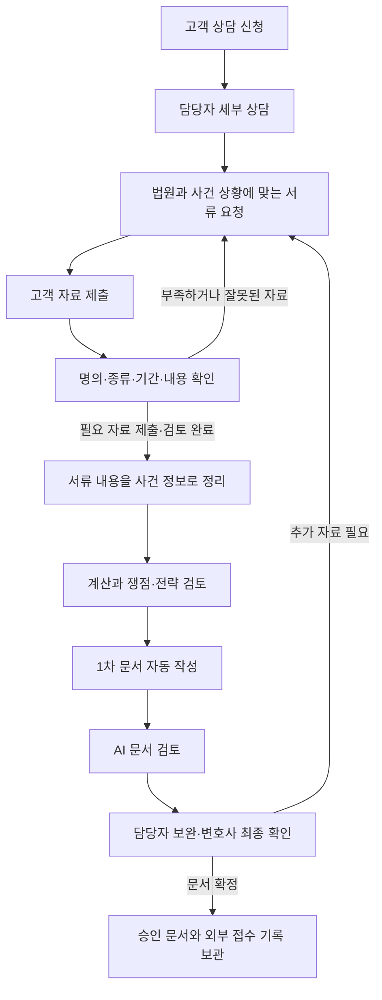

# 사건이 진행되는 흐름

빚오프의 중심에는 한 사건에 모이는 상담, 제출 자료, 확인한 사실, 작성 문서가 있습니다. 앞 단계에서 확인한 내용을 다음 단계가 이어받고, 내용이 달라지면 영향을 받는 계산과 문서를 다시 살펴봅니다. 고객과 사무소가 서로 다른 목록을 관리하지 않도록 같은 사건 기록을 사용합니다.

## 신청부터 최종 검토까지

고객의 첫 상담 신청은 상담을 시작하기 위한 접수입니다. 직원이나 변호사가 세부 내용을 확인하고 상담 완료를 기록해야 본격적인 정보 추출과 서류 선정이 시작됩니다.

자료가 모두 들어와 검토가 끝나면 원문 확인, 정보 정리, 계산·전략 검토, 1차 문서 작성, AI 문서 검토가 이어집니다. 이 구간은 단계마다 승인 버튼을 누르지 않아도 진행합니다. 확인이 덜 된 내용이 있으면 해당 칸과 보완 사유를 남겨 담당자에게 전달합니다.

## 단계마다 무엇이 전달되나요?

| 단계 | 받아서 보는 내용 | 다음 단계에 넘기는 내용 |
| --- | --- | --- |
| 상담 | 고객의 생활 상황, 소득과 채무, 상담 목적 | 서류로 확인할 사실과 추가 질문 |
| 서류 선정 | 상담에서 확인한 상황, 법원별 요청 기준 | 자료 종류, 기관·계좌, 필요한 기간과 발급 조건 |
| 제출·검토 | 고객이 올린 원본과 요청 내용 | 사용할 수 있는 자료, 부족한 이유, 재요청 내역 |
| 내용 추출 | 검토한 서류의 글자·표·페이지 | 금액·날짜·인물·기관 등 확인한 값과 원문 위치 |
| 계산·전략 | 확인된 소득·채무·재산, 적용 기준과 관련 사례 | 계산 결과, 설명할 쟁점, 보완할 정보와 검토 의견 |
| 문서 작성 | 사건의 사실, 계산, 관련 근거 | 신청 문서와 진술서, 작성에 사용한 근거 |
| AI 검토 | 작성 문서와 그 문서의 원자료 | 누락·불일치·근거 부족 목록 |
| 최종 확인 | 검토 목록과 수정한 문서 | 변호사가 확인한 문서 버전, 승인·접수 기록 |

## 누가 어떤 일을 하나요?

고객은 상담을 신청하고 안내받은 자료를 제출합니다. 잘못된 파일이나 부족한 기간이 있으면 알림과 요청 카드에서 사유를 확인하고 다시 제출할 수 있습니다.

직원은 세부 상담을 정리하고 고객에게 필요한 설명을 보냅니다. 자료 검증 화면에서 제출 자료를 확인하고, 자동 추출이나 작성 결과가 원문과 다르면 보완합니다.

변호사는 사실 확인만으로 정할 수 없는 법률 판단과 주요 쟁점을 검토합니다. 문서의 보완 내용과 AI 검토 결과를 살펴보고 최종 승인합니다. 실제 법원 접수 후에는 해당 문서와 접수증을 연결해 기록합니다.

## 진행 상황은 어디서 보나요?

사건 개요의 **진행단계**는 전체 순서와 현재 위치, 기다리는 이유를 한곳에서 보여 줍니다. 자료 부족, 분석 중, 검토 필요를 구분하고 단계를 누르면 해당 업무로 이동합니다. 자료 검증·법률쟁점·문서결과 화면에는 같은 자동화 카드를 반복하지 않습니다. 대시보드의 지표와 보완 의견에서 중간 결과로 이어지고, 이전 처리 내용은 개요에서 펼쳐 볼 수 있습니다.

새 자료가 올라오거나 상담 내용이 바뀌면 이전 결과를 그대로 확정하지 않습니다. 달라진 내용을 기준으로 다시 처리하고, 이전 문서와 수정 기록은 남겨 비교할 수 있게 합니다. 변호사가 승인한 뒤 문서가 바뀌어도 최신 문서를 다시 확인해야 합니다.

## 자료는 어떻게 나누어 보관하나요?

고객이 말한 내용, 서류에서 확인한 사실, 계산으로 얻은 결과, 담당자의 판단을 구분해 보관합니다. 상담에 “가족이 대신 갚았다”는 말이 있어도 실제 채무가 없어졌다고 바로 처리하지 않는 이유입니다. 송금 내역과 채무 확인 자료를 함께 보고 법률관계를 판단해야 합니다.

고객 원문과 개인정보가 포함된 작업은 내부 환경에서 처리합니다. 외부 AI의 검토가 필요한 경우에는 허용한 수치와 분류 정보로 사건을 다시 구성하고 고객 식별정보를 제외합니다. 법령과 공개 사례는 출처와 적용 기준을 함께 관리합니다.

더 자세한 흐름은 [자동 진행과 보완](ax-automation.md), 자료가 값으로 바뀌는 과정은 [서류 내용 정리](document-extraction.md)에서 이어집니다. 개발 시 단계 정의를 확인하려면 [처리 단계 코드](../apps/api/workflow_contract.py)를 참고하면 됩니다.
