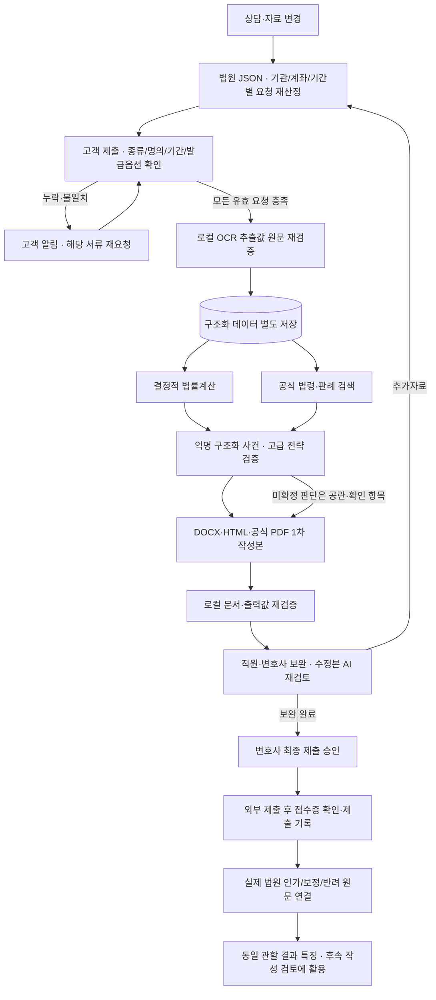

# 자동 처리와 검증 기록

2026-10-04 변경. 상담 추출 팩터의 범위는 유지한다. 기존 상세 화면·이력·값 수정을 남기고, 서류 제출·검토가 완료되면 별도의 승인 클릭 없이 1차 문서와 AI 검토 결과까지 생성한다. 그 뒤 담당자 보완·변호사 최종 승인·제출 기록 순서로 진행한다.

## 코드와 상태

여덟 단계의 입력·출력·진행 조건·실패 처리는 `apps/api/workflow_contract.py`의 정본을 공유한다. 체크포인트는 현재 진행의 기록이며, 재개는 오케스트레이터 재진입과 현재 증빙/법률 해시에 맞는 결과 재사용이다. 중단한 코드 줄부터 이어 실행하지 않는다.

- `apps/api/automation.py`: 수집→검증→계산/전략→작성→재검증. `ax_pipeline`의 실제 단계·사유를 화면에 표시한다. 외부 호출 동안 SQLite 쓰기 트랜잭션을 유지하지 않는다. 분석 당시 사건 버전이나 지식 버전이 바뀌면 저장하지 않는다.
- `court_rules.py` + `data/court_request_rules.json`: 날짜·적용범위·근거를 가진 요청 규칙. 서울·수원·부산·광주의 확보한 항목을 적용하고 나머지 관할은 미검증을 명시한다. 대체자료·기본자료·추가명령 가능 자료를 구분한다.
- `verification.py` + `model_client.py`: 로컬 서류·OCR·문서 대조와 익명 구조화 전략검증. 모든 검증 항목의 근거·출처·응답 완결성을 확인한다. 실패·시간초과·잘린 응답·미확인 값은 통과가 아니다.
- `legal_calculator.py`: 기존 산식·입력 근거·정책·결과 해시를 재사용한다. 자동 계산도 미확인 금액을 0으로 만들지 않으며, 담보·가구 인정 등 미지원/미확정 법률판단은 검토 대상으로 남긴다.
- `preliminary_drafting.py` + `auto_documents.py`: 확인된 근거로 편집 가능한 1차 초안과 공식 PDF 생성. 계산 미확정 값은 공란과 보완 목록으로 남기며 계산 검증 통과본과 구분한다. AI 검토는 실제 PDF와 독립 원문을 대조한다. 자동 작성은 법원 접수·인가, 사람의 서명·동의·승인을 뜻하지 않는다.
- `document_review_routes.py`: 수정 작성본의 로컬 AI 재검토와 이전·새 검토 결과 보존. 작성본 자체를 근거로 사용하지 않으며 승인된 문서는 새 버전으로 수정한다.
- `filing.py` + `filing_routes.py`: 현재 공식 작성본 7종·검증 계산·원문 및 AI 검토를 확인한 패키지의 변호사 최종 승인. 별도 접수증은 원래 사건 증빙 리비전을 바꾸지 않으며 외부에서 접수한 제출 사실만 기록한다. 법원 전송 연동은 없다.
- `legal_watch.py` + `data/legal_watch_policy.json`: 공식 원문의 변경·시행일 감시와 적용 버전 관리. 관련 사건의 서류 선정·계산·전략·문서를 다시 확인한다.
- `reasoning_cache.py`: 익명 고급 검증의 결과 재사용·동시 호출 합치기·하루 호출 한도를 SQLite로 관리한다.

자동 작성·AI 검토 뒤에는 `human_review`에서 담당자 보완과 최종 승인을 기다린다. 최종 승인 후 `submission_ready`, 접수 근거 확인·제출 기록 후 `submitted`가 된다. OCR·계산·전략 미확정 때문에 초안 작성 자체를 생략하지 않는다. 앞선 미통과 단계는 `review_required`로 남겨 성공으로 표시하지 않는다. 자료 미제출·명의 충돌·요청 검토 미완료는 먼저 보완해야 한다. 업로드 때의 판독은 서류 분류·범위 확인에 쓰고, 계산용 구조화와 원문 대조는 자료 완비 후 진행한다.

실행 중 최신 제출·검토가 도착하면 이전 근거의 모델 작업을 취소하고 최신 입력으로 진행한다. 실행 중 작업과 대기 중 갱신을 분리 표시하고 단계별 묶음 진행 건수를 갱신한다. 시간초과·연결 실패는 통과로 처리하지 않으며 같은 실행의 나머지 묶음에 동일 시간초과를 반복하지 않는다. 성공한 동일 입력의 로컬 검증만 제한된 메모리 캐시로 재사용한다. 담당자가 원문·명의·범위를 직접 확인한 현재 파일은 자동 판독의 과거 경고로 재요청하지 않는다.

고객 신청은 먼저 `consultation_waiting`에 머문다. `intake_workflow.py`가 신청 원문과 상세 상담을 구분하고, 담당자의 세부 상담 요청 및 상담 기록 저장 후 추출을 허용한다. 신청 대기 중에는 자동 스케줄·수동 분석·요청 재조정·작업 실행을 차단한다. 고객 메시지와 제출 파일은 정상 보관한다. 직원이 이미 진행한 회의록을 직접 등록한 사건에는 기존 경로를 적용한다.

기존 증빙 기반 수동 계산·검토 이력을 유지한다. 상세 상담을 완료한 사건의 새 서류, 상담, 요청 범위, 사실·쟁점·계산 수정은 이전 결과를 만료시키고 자동 분석을 예약한다. 요청을 철회해도 제출 파일과 요청 이력은 삭제하지 않는다. 수동으로 철회한 동일 범위는 자동으로 다시 요청하지 않는다.

알림을 읽는 동작만으로 진행 중 분석을 폐기하지 않는다. 분석 시작 당시 사건과 현재 사건의 차이가 계정별 알림 읽음·관련 감사/버전 갱신뿐인 경우에 한해 최신 읽음·감사 이력을 합쳐 저장한다. 자료·판단·다른 상태·적용 법률이 바뀌었으면 기존처럼 저장을 거부하며, 알림 병합을 이용해 그 변경을 덮어쓰지 않는다.

## 개인정보 처리

원문, 실명, 주민번호, 계좌, 연락처, 주소, 상담 자유문장은 로컬 경계에서만 처리한다. 일반 파싱 호출은 외부 제공자가 설정되어 있어도 로컬로 보낸다. 원문 처리 주소는 loopback 또는 명시된 로컬 컨테이너 호스트만 허용한다.

외부 검증은 허용한 수치·불리언·열거값과 공개 법령/판례만 사용한다. 이름을 정규식으로 일부 지우는 방식 대신 전송 필드를 새로 구성하므로 자유문장·파일명·고객 ID·기관계좌는 전송 구조에 들어가지 않는다. 공개 판례 본문도 호출자가 넘긴 문장을 그대로 보내지 않고 로컬에서 다운로드 해시가 확인된 원문으로 채운다. 모델이 제시한 출처 별칭이 허용 목록에 없으면 거부한다.

사용자가 지정한 API 키는 유효한 `.env`, `.env.example`, 실행 환경 순서로 선택한다. 값은 메모리에서만 읽고 화면·보고서에 표시하지 않는다. 다른 환경 설정의 일반 우선순위는 환경→`.env`→`.env.example`이다. 외부 검증의 실제 호출 결과와 로컬 실제 호출은 합성 데이터로 별도 검증한다.

## 저장과 결과 축적

`structured_case_data`, `generated_document_versions`, `court_outcomes`를 SQLite에 별도로 보관한다. 사건 변경·감사·별도 저장은 같은 트랜잭션이다. 출력 버전은 ID·내용 해시로 보관하고 기존 버전을 덮어쓰지 않는다. 결과 등록에는 해당 생성 버전, 확인한 법원 원문, 변호사 권한이 필요하다.

동일 사무소·동일 관할의 실제 결과만 집계한다. 합성 사례와 미검증 기록은 학습 특징에서 제외한다. 생성 당시 특징을 해당 결과와 연결하므로 나중에 수정된 사건 데이터를 과거 문서의 특징으로 붙이지 않는다. 현재 결과 축적은 검색·작성 검토에 활용하는 방식이며 모델 가중치를 자동 재학습하거나 법률 규칙을 무검증으로 변경하지 않는다.

사건 개요의 **인가 가능성 참고 지표**는 개별 예측과 유사 사건의 관측 비율을 분리한다. 검증된 종결 결과가 최소 30건에 못 미치면 비율을 표시하지 않고 `예측 보류 / 결과 표본 부족`을 표시한다. 충분한 표본에는 서버가 계산한 관측 비율·95% 신뢰구간·인가/불인가/보정 분포를 표시한다. 이는 개별 사건의 승인 확률이 아니며 개별 예측은 검증 자료가 확보될 때까지 보류한다. 법원 결과 기록에서 결정 유형·결정일·원문 주문을 연결하고, 개시·보정·면책과 최종 인가·불인가·신청 기각을 구분한다.

대법원 `2018마7459`는 변경 변제계획의 이행 후 면책을 유지한 사례이며 신규 신청 인가 표본이 아니다. 새로 수집한 대법원 `2010마1179`, `2015마657`, `2014마1255`는 모두 파기환송 사례이다. 실제 인가 사례로 바꾸어 집계하지 않는다. 청산가치·처분대금·배우자 재산·보정 시정기회·수행가능성에 관한 검토 근거로 사용한다. 원문과 해시는 `data/legal_research/manifest.json`, 적용 조건과 배제할 추론은 `data/ax_legal_precedents.json`에 저장한다.

## 법령 변경 감시와 호출 제한

사무소의 **운영 현황·수집 지식함 → 법령과 법원 기준**에서 최근 확인·다음 확인·변경 원문·시행일·적용 버전을 확인한다. 직원은 수동 확인을 요청하고 변호사는 등록된 공식 출처, 확인 주기(24~720시간), 하루 출처 수(1~20개), 하루 고급 검증 횟수(1~100회)를 조정한다. 출처 감시는 모델을 호출하지 않는다. HTTP 조건부 요청과 본문 해시를 사용하며 하루 HTTP 40회, 출처별 최대 2회 시도 제한은 수동 확인이나 재시작으로 초기화되지 않는다.

정기 확인은 API 서버가 실행 중이고 `DEBTOFF_LEGAL_WATCH=1`일 때만 동작한다. 기본 주기는 24시간이며 로컬 실행기의 설정과 화면의 실제 활성 상태를 확인한다. PC가 꺼져 있는 동안 확인하는 운영체제 예약 작업이나 외부 스케줄러는 설치하지 않는다. 확인 실패 시 마지막 정상 근거를 유지하고 오류를 표시한다.

기준 원문과 일치하는지 먼저 대조한다. 자동 수치 반영은 채무자회생법 제579조의 두 채무한도와 제611조의 두 변제기간에 한정한다. 수치 이외의 주변 문언 전체가 검토된 지문과 같고 시행일도 확인된 경우만 적용한다. 장래 시행본은 별도로 보관하고 시행일 후 정기 확인에서 적용한다. 새 조문·조건·경과규정, 의미가 바뀐 법원 기준은 실행 규칙으로 자동 승격하지 않고 해당 사건의 검토를 보류한다. 모든 개정사항을 법률적으로 해석·적용하는 기능은 아니다.

고급 검증 결과는 개인정보 전송 경계 검사를 통과한 입력·프롬프트·응답 구조·실행 설정·적용 법률 버전의 해시로 구분한다. 완결되고 검증된 익명 응답만 기본 7일 재사용하며 원문 프롬프트는 캐시에 저장하지 않는다. 동시에 같은 검증이 요청되면 진행 중 호출을 공유한다. 동일 입력·단계에는 최초 검증과 보완 검증을 합해 최대 2회만 허용하고, 실패도 사용 횟수에 포함한다. 기본 하루 한도는 20회이며 한국 날짜 기준으로 집계한다. 자료·적용 법률이 바뀌면 별도 키로 검증하고 한도 초과를 성공으로 처리하지 않는다. 캐시와 사용 이력은 `.local/reasoning-cache.sqlite3`, 법령 원문·상태·적용 버전은 `.local/legal_watch/`에 저장한다(`DEBTOFF_DATA_DIR` 변경 시 해당 저장소 사용).

## 화면과 운영

React 원본은 `apps/frontend/src`, 재현 빌드는 `apps/frontend`에서 `npm.cmd run build`이다. 고객 주요 화면과 사무소 셸·진행 컴포넌트는 React로 구성하고 기존 사무소 상세 편집/이력 화면은 연결해 유지한다. 이미지와 React 번들은 로컬에서 제공한다. 이미지 출처·라이선스는 `apps/shared/images/credits.json`에서 확인한다.

서류 요청·검토 내용은 자료명·기간·상태·기한을 가진 카드와 한국어 항목으로 표시한다. 이전에 JSON 문자열로 저장된 내용도 읽을 수 있게 변환하며 기관·계좌·기간은 항목별 입력 화면에서 수정한다. 법원 서식 화면은 최신 작성 문서 카드를 먼저 보여주고 이전 버전은 이력에, 공식 빈 PDF/HWP 원본은 하단에 모은다. 사건 진행 이력은 실제 자동 처리·원문 검증·전략 검토 기록과 연결한다. 이력을 펼치면 각 단계의 확인 자료·처리 결과·다음 진행 조건·보완 방법과 저장된 진행 조건 확인 기록을 한국어로 확인한다.

작성본의 **새 버전 작성**은 최신 사건 미리보기를 사용하며 이전 PDF를 덮어쓰지 않는다. 현재 입력 버전의 비만료 수동 확정 계산 또는 자동 검증 통과 계산을 연결한다. 진술서는 기본적으로 사실·증빙 기반 작성과 원문 검증을 수행한다. 화면은 작성 중 중복 제출을 막고 진행을 표시하며, 해당 요청만 최대 10분을 기다린다. 사용자가 직접 수정한 진술은 별도 검토 대상이며 자동 검증된 문장으로 표시하지 않는다. 진술 문장 검증 통과가 PDF 배치·서명·전체 제출서류 검토 완료를 뜻하지 않는다.

지식함의 원문 읽기는 저장된 페이지·전체 본문을 표시하며 본문 내 검색을 제공한다. 본문 미확보 출처는 수집 오류와 개별 재수집 버튼을 표시한다. 재수집 완료 후 원문을 다시 열고, 실패한 수집을 본문 확보로 표시하지 않는다. 이전 검색 구간만 저장된 자료도 열람할 수 있다.

법령 사이트의 메뉴 화면만 반환하던 개별 조문은 해시로 확인한 동일 법령판의 전체 공식 본문에서 해당 조문을 추출해 저장한다. 출처·법령판·조문 연결을 유지하며 다른 법률이나 확인되지 않은 판본으로 대체하지 않는다. 개별 재수집은 해당 등록 출처만 대상으로 한다.

고객 알림은 현재 공통 DB 기반 인앱 알림이다. 문자·이메일 공급자 발송은 별도 연결되어 있지 않다. 단일 서버 작업 실행기를 사용하며 서버가 종료되면 진행 중 작업은 실패로 남아 재실행할 수 있다. 법원별 미확보 기준·미지원 계산·실제 미판독 자료를 자동 성공으로 처리하지 않는다.

`python scripts/browser_ax_automation.py`는 격리된 합성 API 응답으로 React 화면·권한별 버튼·알림·자료 보완·법령 확인 설정을 검증한다. 실제 법률 판단이나 외부 호출 성능을 검증하는 시험은 아니다. API·캐시·법령 변경 감시 회귀시험은 `python scripts/run_tests.py`로 실행하며 현재 시연 DB와 분리한다.

`python scripts/browser_runtime_readonly.py`는 실행 중인 시연 서버에서 실제 저장 법률 본문·진행 상태·작성본/원본 배치·다운로드 파일명을 확인한다. 로그인 외에는 조회만 허용하며 작성 문서가 없으면 파일명 확인을 위해 새 문서를 만들지 않는다. 실제 결과는 `reports/browser-runtime-readonly.json`에 기록한다.

## 진술서 작성과 독립 검증

`grounded_drafting.py`는 채무 발생 경위·지급 곤란 사정·향후 변제계획의 세 문단을 근거별로 작성한다. `statement_authoring.py`는 D5105의 직접 작성 버튼도 같은 로컬 작성·독립 검증 경로로 연결한다. 사실별 정확한 원문 인용과 숫자를 대조하며 상담 원문을 복사하는 대체 경로는 없다. 의미상 검증 실패는 발견 사항을 반영해 한 번만 수정하고, 시간초과·모델 사용 불가는 자동 재시도하지 않는다.

기존 문단은 현재 작성 버전·작성 정책·입력 증거·상담·계산·법률 버전의 서명이 일치할 때만 재사용한다. 실패하면 새 PDF를 생성하지 않고 사유·담당자 알림·검토 이력을 보존한다. API의 409 응답은 변경된 `case_version`을 포함하므로 다음 요청은 이 버전을 사용한다. 직원이 명시적으로 직접 작성한 진술은 별도 검토 대상으로 유지한다. 실제 최신 작성 결과는 `reports/statement-authoring-live.json`을 확인한다.

유사 결과 비율은 같은 사무소·관할·사건유형·생성 당시 재무 구간·법률정책 버전에서 최근 730일의 최초 종결 결과를 대상으로 한다. 인가/(인가+불인가+개시신청기각)를 계산하며 보정·개시·면책은 분모에서 제외한다. 합성·미검증·중복 결과는 제외한다. 최소 30건은 표시 정책이고 통계적 정확도나 인가 보장이 아니다. 표시되는 95% 구간은 Wilson 방식이며 개별 예측 값은 보정된 모델과 독립 평가가 없어 비워 둔다.
